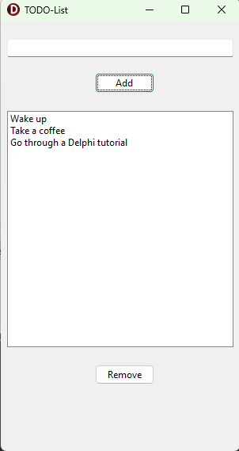

# 

- A simple **TODO app** 

- built with Delphi 12 (Community Edition) 

- using the **VCL framework**. 

I felt like I needed to do this. Now it's off my TODO-list 🥳

More complex than e.g. [Matlab AppDesigner! - YouTube](https://www.youtube.com/watch?v=jb19-roQuRk).

IDE: [Delphi Community Edition](https://www.embarcadero.com/products/delphi/starter/free-download/)
